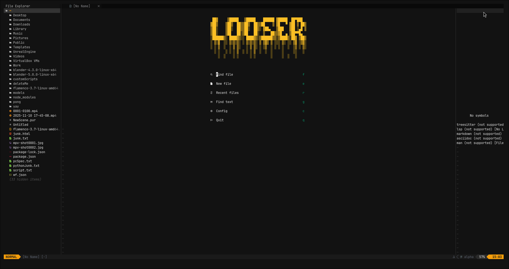

# Custom Neovim Configuration (C++ Focused)

A powerful, modern, and aesthetically pleasing Neovim configuration built for C++ development. This setup features a custom dashboard, automated workspace layout, and a robust LSP/Debugging stack.



## ✨ Features

-   **C++ Powerhouse**: Pre-configured with `clangd` (LSP), `codelldb` (Debugging), and `clang-format`.
-   **Automated Workspace**: Automatically opens the **File Explorer** (Left) and **Symbol Outline** (Right) on startup, keeping the **Dashboard** focused in the center.
-   **Custom Dashboard**: Unique "LOOSER" ASCII art welcome screen.
-   **Symbol Navigation**: `aerial.nvim` provides a live outline of your classes and functions.
-   **Smart Completion**: Full auto-completion for code, command-line (`:`), and search (`/`).
-   **Lazy Loading**: Fast startup times using `lazy.nvim` plugin manager.

## 🚀 Installation

1.  **Backup** your existing configuration:
    ```bash
    mv ~/.config/nvim ~/.config/nvim.bak
    mv ~/.local/share/nvim ~/.local/share/nvim.bak
    ```

2.  **Clone** this repository:
    ```bash
    git clone https://github.com/looser-xxx/nvimSetup.git ~/.config/nvim
    ```

3.  **Install Dependencies**:
    
    See `requirements.txt` for a full list. You can install them using your package manager:

    ### 🐧 Ubuntu / Debian (apt)
    ```bash
    sudo apt update
    sudo apt install neovim git ripgrep build-essential unzip xclip curl
    ```
    *(Note: Ensure you are installing Neovim v0.9.0+. You may need the [PPA](https://launchpad.net/~neovim-ppa/+archive/ubuntu/unstable) for older distributions).*

    ### 🏹 Arch Linux (pacman)
    ```bash
    sudo pacman -S neovim git ripgrep base-devel unzip xclip
    ```

    ### 🎩 Fedora (dnf)
    ```bash
    sudo dnf install neovim git ripgrep gcc make unzip xclip
    ```

    *It is also recommended to install a **Nerd Font** (e.g., JetBrainsMono Nerd Font) for icons to render correctly.*

4.  **Start Neovim**:
    ```bash
    nvim
    ```
    *Wait a moment for `lazy.nvim` to automatically install all plugins.*

## 🎨 Customization

### Changing the Dashboard Art
You can easily customize the ASCII art shown on the dashboard!

1.  Open the file `asci.txt` in the root of your config.
2.  Paste your desired ASCII art into this file.
3.  **Restart Neovim**, and your new art will appear on the dashboard.
    *(Note: You may need to update `lua/plugins/ui.lua` if you want to change the art programmatically, but updating `asci.txt` serves as the source reference.)*

## ⌨️ Key Bindings

**Leader Key**: `Space`

| Action | Keybinding |
| :--- | :--- |
| **File Explorer** | `<Space> e` |
| **Find Files** | `<Space> ff` |
| **Live Grep** | `<Space> fg` |
| **Symbol Outline** | `<Space> a` |
| **Formatting** | `<Space> mp` |
| **Lazy Manager** | `<Space> l` |

### LSP & Debugging
-   `gd`: Go to Definition
-   `K`: Hover Documentation
-   `<Space> db`: Toggle Breakpoint
-   `<Space> dc`: Start/Continue Debugging

## 📂 Structure

-   `init.lua`: Entry point.
-   `lua/config/`: Core settings (keymaps, options, autocommands).
-   `lua/plugins/`: Plugin configurations (LSP, UI, Completion, etc.).
-   `asci.txt`: Source for dashboard art.
